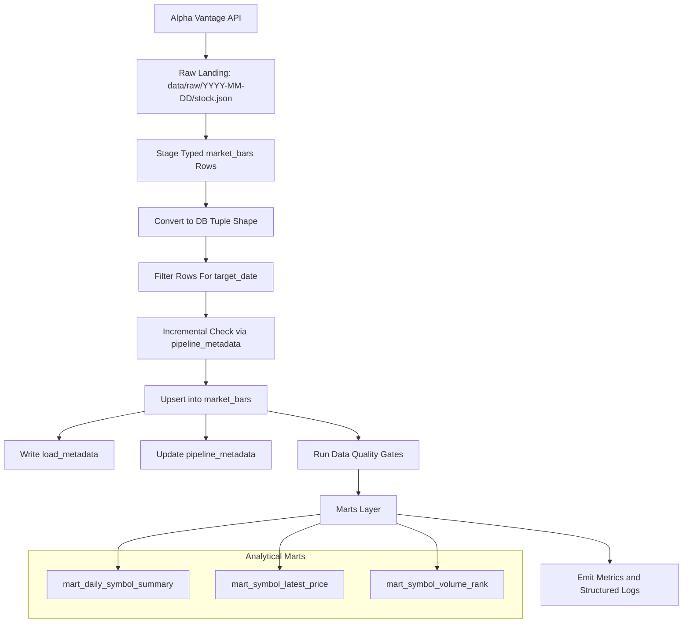

# de-lakehouse-pipeline

A production-style data engineering lakehouse pipeline for Alpha Vantage market
data. It ingests raw stock payloads, lands them locally or optionally in S3,
loads new rows into Postgres, builds SQL marts, and validates the workflow with
tests, orchestration metrics, and reliability drills.

This project is designed as a practical foundation for growing from Data
Engineering into MLOps, ML Systems, and AI Platform workflows.

---

## What It Does

* Fetches daily stock market data from the Alpha Vantage API
* Stores raw JSON payloads locally, with optional AWS S3 upload
* Stages and normalizes market data into typed `market_bars` rows
* Loads data incrementally into Postgres with idempotent upsert semantics
* Tracks load metadata and watermarks for safe reruns
* Builds analytical SQL marts for summary, latest-price, and volume-rank views
* Supports data quality checks, resumable backfills, and local orchestration

---

## Architecture


```mermaid
graph TD
    A[Alpha Vantage API] --> B[Raw Landing: data/raw/YYYY-MM-DD/stock.json]
    B --> C[Stage Typed market_bars Rows]
    C --> D[Convert to DB Tuple Shape]
    D --> E[Filter Rows For target_date]
    E --> F[Incremental Check via pipeline_metadata]
    F --> G[Upsert into market_bars]
    G --> H[Write load_metadata]
    G --> I[Update pipeline_metadata]
    G --> Q[Run Data Quality Gates]
    Q --> J[Marts Layer]
    J --> K[Emit Metrics and Structured Logs]

    subgraph "Analytical Marts"
        I1[mart_daily_symbol_summary]
        I2[mart_symbol_latest_price]
        I3[mart_symbol_volume_rank]
    end

    J --> I1
    J --> I2
    J --> I3
```

Detailed flow diagram: `docs/project_run_flow.svg`

---

## Quickstart

```bash
git clone https://github.com/Ericliu-eng/de-lakehouse-pipeline.git
cd de-lakehouse-pipeline

cp .env.example .env

make setup
make db-up
make db-migrate
make run
make run-marts
make test
```

Inspect the database:

```bash
make db-shell
```

---

## Common Commands

```bash
make setup        # create venv and install deps
make lint         # run ruff
make db-up        # start Postgres container
make db-down      # stop Postgres container
make db-migrate   # apply database schema
make run          # run the default daily stock pipeline
make run-marts    # build analytical marts
make smoke        # run lightweight smoke tests
make smoke-db     # run DB-backed smoke tests
make integration  # run DB-backed integration tests
make test         # run unit, smoke, and integration tests
make db-shell     # open psql shell in container
```

Run a specific symbol:

```bash
python -m de_lakehouse_pipeline.cli run_stock --symbol MSFT
```

Run a historical backfill:

```bash
python -m de_lakehouse_pipeline.cli backfill --start 2026-04-16 --end 2026-04-18 --symbol AAPL
```

Run the orchestrated local pipeline:

```bash
make orchestrate SYMBOL=AAPL
```

---

## Key Features

* **Incremental loading:** reads the last processed watermark from
  `pipeline_metadata` and loads only newer rows.
* **Idempotent writes:** upserts into `market_bars` using the `(ts, symbol)`
  grain.
* **Data quality gates:** validates not-null constraints, uniqueness, numeric
  ranges, and freshness.
* **SQL marts:** builds `mart_daily_symbol_summary`,
  `mart_symbol_latest_price`, and `mart_symbol_volume_rank`.
* **Cloud-ready raw landing:** supports optional S3 upload and Terraform
  validation.
* **Reliability drills:** covers retryable API failures, schema validation,
  backfills, and DB write safety.

---

## Cloud And Terraform

S3 upload is disabled by default. To enable it for a run:

```bash
ENABLE_S3_RAW_UPLOAD=true
S3_RAW_BUCKET=de-lakehouse-raw
python -m de_lakehouse_pipeline.cli run_stock --symbol AAPL
```

Validate the local S3 storage contract without AWS credentials:

```bash
make cloud-storage-test
make terraform-validate
```

---

## Validation

The test suite is layered so quick local checks and DB-backed checks can run
separately:

```bash
make unit
make smoke
make smoke-db
make integration
make test
```

Because `make test` includes integration tests, start Postgres and run
migrations before using it in a fresh local environment.

CI validates the main workflow with dependency setup, linting, DB migration,
smoke tests, pytest, integration tests, and Terraform validation.

---

## Docs

| Topic | Doc |
| --- | --- |
| Setup and standards | `docs/DEV_SETUP.md`, `docs/STANDARDS.md` |
| Data model and SQL | `docs/DATA_MODEL.md`, `docs/DEMO_QUERIES.md` |
| Incremental loading | `docs/INCREMENTAL.md` |
| Backfill | `docs/BACKFILL.md` |
| Data quality | `docs/DATA_QUALITY.md` |
| Cloud and cost notes | `docs/CLOUD_STORAGE.md`, `docs/CLOUD_RUN.md`, `docs/COST_NOTES.md` |
| Orchestration and metrics | `docs/ORCHESTRATION.md`, `docs/OPS_METRICS.md` |
| Reliability drills | `docs/FAILURE_DRILLS.md` |
| Terraform | `infra/terraform/README.md` |
| Weekly progress | `docs/WEEKLY_LOG.md` |

---

## Project Value

This project demonstrates practical data engineering patterns:

* external API ingestion and raw data landing
* database-backed incremental processing
* reproducible local and CI workflows
* SQL modeling and data quality checks
* orchestration, observability, and reliability testing
* cloud-oriented storage and infrastructure foundations

It is compact, but it reflects patterns that scale toward feature pipelines,
MLOps systems, and AI platform data foundations.
