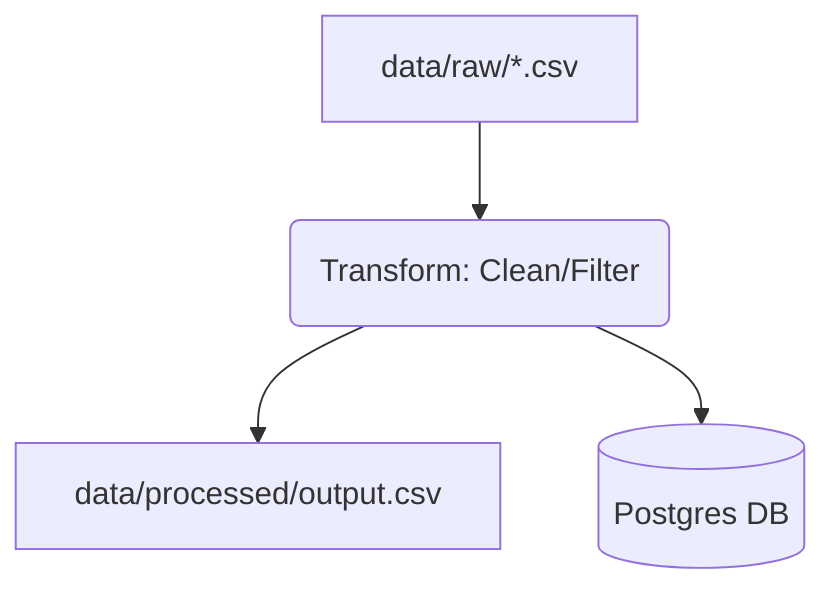

# de-lakehouse-pipeline

A minimal production-style **data engineering pipeline** demonstrating
reproducible workflows, SQL validation, database migrations, and CI-tested data pipelines.
Built as a foundation for **Data Engineering → MLOps → AI Platform systems.**

---

## Overview
This project implements a minimal but production-style data pipeline:
**Raw Data → Transform → Storage (File + Postgres)**
It is designed to demonstrate:
- Reproducible data engineering workflows
- Modular pipeline design
- Database integration (Postgres)
- CI-tested data pipelines
---


##  Demo (2-minute run)
Run the full pipeline locally:
```bash
cp .env.example .env
make setup
make db-up
make migrate
make run
make test
```
---

## Tech Stack
- Python 3.11
- Postgres
- Docker Compose
- Pytest (testing)
- Ruff (linting)
- Makefile (reproducible workflows)
- GitHub Actions (CI)

---

##  Architecture

```mermaid
graph TD
A[data/raw/*.csv] --> B(Transform: Clean/Filter)
B --> C[data/processed/output.csv]
B --> D[(Postgres DB)]
```
---

## Components
- **Extract**: Read raw CSV data
- **Transform**:
  - Drop null values
  - Filter invalid rows (e.g., negative values)
- **Load**:
  - Save processed CSV
  - Insert into Postgres tables
---

## Database (Postgres)
### Start database
```bash
make db-up
```
### Run migrations (create schema + seed data)
```bash
make migrate
```
### Verify database (smoke test)
```bash
make db-smoke
```
### Stop database
```bash 
make db-down
```

---

## Testing
This project includes multiple layers of testing:
#### Unit Tests
  - Transform logic validation
  - Edge cases (nulls, invalid values)
#### Smoke Tests
  - End-to-end pipeline execution (tmp_path)
  - Database connectivity (test_db_smoke.py)
#### Run all tests:
```bash
make test
```
---

## Example
| Stage | Data Sample |
| :--- | :--- |
| **Input** (`data/raw/sample.csv`) | `name,amount`<br>`A,10`<br>`B,-5`<br>`,20` |
| **Output** (`data/processed/output.csv`) | `name,amount`<br>`A,10` |

---

## Database Schema
#### Example table (via migration):
- users
  - id (int)
  - name (text)
  - amount (int)
#### Created using:
```bash
make migrate
```
---

## Project Structure
```
src/de_lakehouse_pipeline/   # pipeline logic
scripts/                     # migration scripts
tests/                       # unit + smoke tests
data/                        # raw + processed data
docs/                        # proof / logs
```

---

## SQL Validation Layer
The pipeline includes reusable SQL patterns and validation queries:

- Window functions (`ROW_NUMBER`) for deduplication
- Data quality checks (null / duplicate detection)
- SQL execution tested via pytest

Location:
```
sql/
├── patterns_window.sql
└── quality_checks.sql
```

## Reproducibility
### All workflows are standardized via Makefile:
```bash
make setup
make lint
make test
make run
make migrate
```
### Works consistently across:
 - Local environment
 - CI (GitHub Actions)
---

## CI (GitHub Actions)
### On every pull request, CI automatically runs:
```bash
make setup
make lint
make migrate
make db-smoke
make test
```


#### Runs automatically on every pull request.
----


## Why this project
#### This project demonstrates:
  - Data Engineering best practices (modularity, testing, CI)
  - Reproducible pipelines using Makefile
  - Database-backed workflows with migration
  - Foundations for scaling into MLOps / production systems
