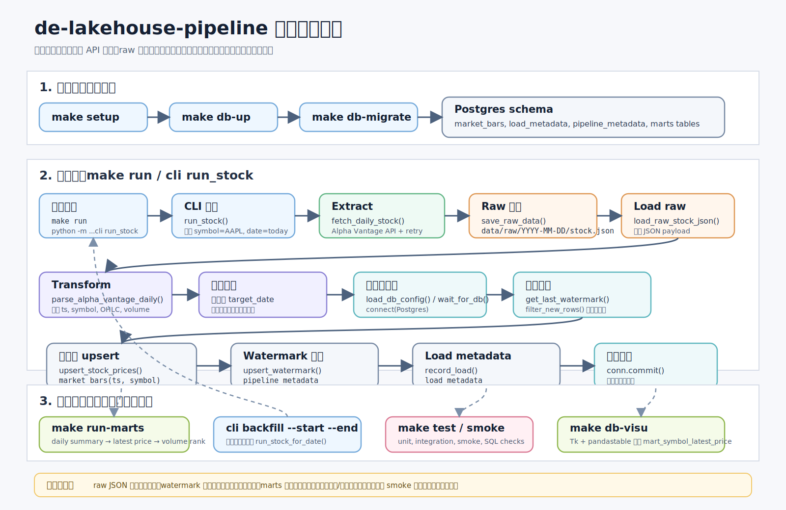

# de-lakehouse-pipeline

A production-style market-data pipeline that moves Alpha Vantage payloads from
raw JSON to an incremental PostgreSQL warehouse, quality-gated analytical marts,
and a small FastAPI serving layer.

The project focuses on practical data-engineering concerns: idempotency,
watermarks, backfills, data quality, orchestration, observability, testing, and
reproducible local development.

## Architecture



```text
Alpha Vantage
  -> Raw JSON
  -> Typed Staging
  -> Watermark Filter
  -> PostgreSQL Warehouse
  -> Data Quality Gate
  -> Analytical Marts
  -> FastAPI / Dashboard
```

See [Architecture](docs/ARCHITECTURE.md) for component boundaries and design
decisions.

## Engineering Highlights

| Capability | Implementation |
| --- | --- |
| Incremental loading | Watermark per `(source, symbol)` in `pipeline_metadata` |
| Idempotent writes | Primary-key upserts on `(ts, symbol)` |
| Raw-data auditability | Source payloads preserved before transformation |
| Data quality | Null, uniqueness, range, and freshness gates before marts |
| Backfill recovery | Inclusive date ranges with checkpoint-based resume |
| Orchestration | Deterministic CLI runner plus a local Dagster job and schedule |
| Serving | FastAPI endpoints and dashboard backed by curated marts |
| Validation | Ruff, pytest, PostgreSQL integration tests, and GitHub Actions |

## Technology

Python · PostgreSQL · Docker · Dagster · FastAPI · SQL · Terraform · AWS S3
scaffold · pytest · Ruff · GitHub Actions

## Quickstart

Clone the repository and install dependencies:

```bash
git clone https://github.com/Ericliu-eng/de-lakehouse-pipeline.git
cd de-lakehouse-pipeline
make setup
```

Start PostgreSQL, apply migrations, and run the complete local validation:

```bash
make db-up
make db-migrate
make test
```

`make test` includes unit, smoke, and database-backed integration tests. See
[Development Setup](docs/DEV_SETUP.md) for PowerShell and Bash environment
configuration.

## Live Pipeline Demo

Add `ALPHA_VANTAGE_API_KEY` to `.env`, then run the quality-gated workflow:

```bash
make orchestrate SYMBOL=AAPL
```

Start the serving layer:

```bash
python -m src.serve.api
```

Open:

- Health: <http://127.0.0.1:8000/health>
- Latest price: <http://127.0.0.1:8000/latest-price>
- Dashboard: <http://127.0.0.1:8000/dashboard>

The successful workflow produces normalized `market_bars`, incremental and
load metadata, and three analytical marts:

- `mart_daily_symbol_summary`
- `mart_symbol_latest_price`
- `mart_symbol_volume_rank`

## Common Operations

```bash
make run SYMBOL=MSFT
make run-marts
make backfill START=2026-04-16 END=2026-04-18 SYMBOL=AAPL
make dagster-dev
make db-shell
make db-down
```

See the [Local Operations Runbook](docs/RUNBOOK.md) for validation, inspection,
and troubleshooting.

## Validation and CI

| Command | Purpose |
| --- | --- |
| `make lint` | Run Ruff static analysis |
| `make unit` | Run unit tests without PostgreSQL |
| `make smoke` | Run lightweight smoke tests |
| `make smoke-db` | Run database-backed smoke tests |
| `make integration` | Validate marts and metadata behavior |
| `make test` | Run the default local suite |
| `make terraform-validate` | Validate the Terraform scaffold |

GitHub Actions provisions PostgreSQL, installs dependencies, runs migrations,
executes lint and tests, and validates Terraform on pushes to `main` and pull
requests.

## Current Scope

- Dagster job and schedule definitions run locally and are not production
  deployed.
- Metrics are emitted as JSON and structured logs but are not persisted to an
  observability platform.
- The S3 object layout, upload adapter, bucket, and least-privilege IAM policy
  scaffold exist; runtime client and workload identity wiring are incomplete.
- Failure drills document verified safeguards separately from remaining
  engineering gaps.

These boundaries are documented explicitly rather than presented as production
capabilities.

## Documentation

| Topic | Document |
| --- | --- |
| Architecture | [docs/ARCHITECTURE.md](docs/ARCHITECTURE.md) |
| Setup and operations | [docs/DEV_SETUP.md](docs/DEV_SETUP.md), [docs/RUNBOOK.md](docs/RUNBOOK.md) |
| Data model and queries | [docs/DATA_MODEL.md](docs/DATA_MODEL.md), [docs/DEMO_QUERIES.md](docs/DEMO_QUERIES.md) |
| Incremental loading and backfill | [docs/INCREMENTAL.md](docs/INCREMENTAL.md), [docs/BACKFILL.md](docs/BACKFILL.md) |
| Data quality | [docs/DATA_QUALITY.md](docs/DATA_QUALITY.md) |
| Orchestration and metrics | [docs/ORCHESTRATION.md](docs/ORCHESTRATION.md), [docs/OPS_METRICS.md](docs/OPS_METRICS.md) |
| Reliability | [docs/FAILURE_DRILLS.md](docs/FAILURE_DRILLS.md) |
| Cloud storage | [docs/CLOUD_STORAGE.md](docs/CLOUD_STORAGE.md), [infra/terraform/README.md](infra/terraform/README.md) |
| Contribution standards | [docs/STANDARDS.md](docs/STANDARDS.md) |
