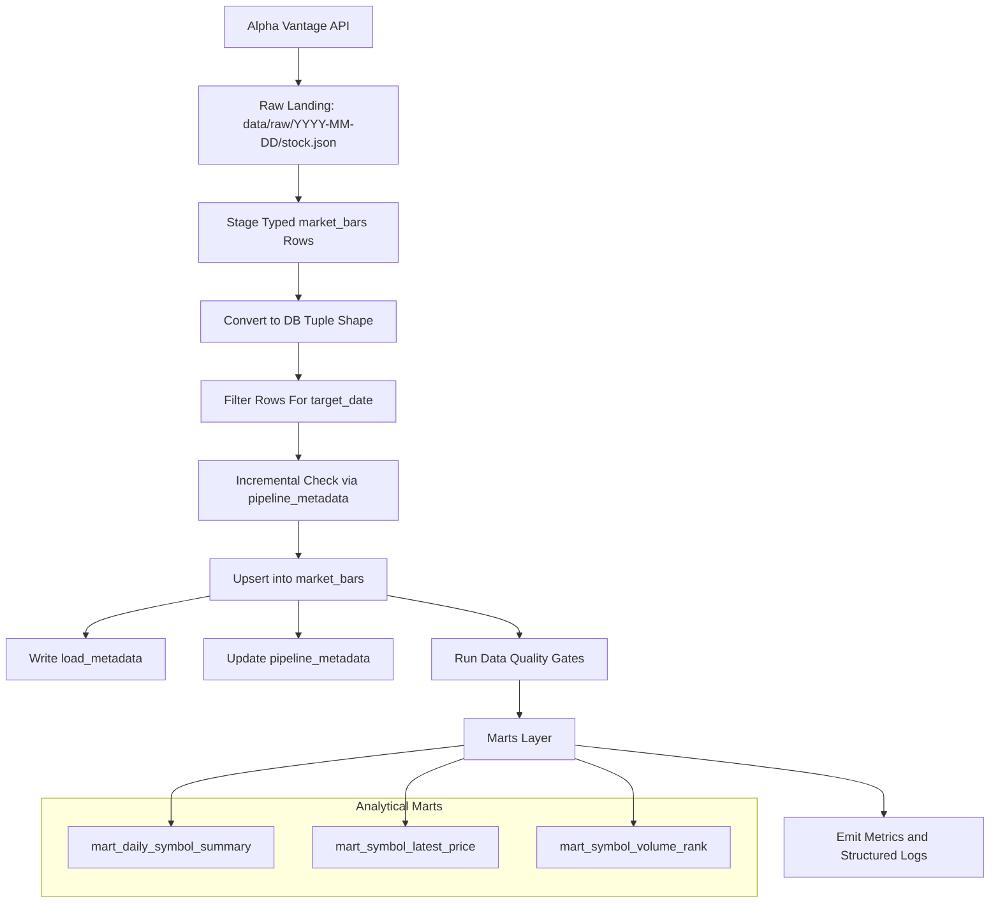

# de-lakehouse-pipeline (README v2)

A minimal production-style data engineering pipeline demonstrating:

* API ingestion
* raw JSON landing
* incremental database load with idempotent upsert
* backfill with checkpoint resume
* AWS S3 raw partition storage contract
* SQL-based marts
* data quality gates
* orchestration with metrics and structured logs
* reproducible workflows and CI-tested execution

This project is designed as a practical foundation for growing from
Data Engineering into MLOps, ML Systems, and AI Platform workflows.

---

## Overview

This pipeline ingests daily stock market data from Alpha Vantage, stores the
raw payload locally, loads new records into Postgres, and builds downstream
analytical marts from the raw table.

Current end-to-end flow:

```text
Alpha Vantage API
-> Raw Landing (JSON)
-> Staging: typed market_bars rows
-> DB tuple conversion
-> Filter to target date
-> Incremental check via pipeline_metadata watermark
-> Upsert into Postgres market_bars
-> Record load metadata
-> Data quality gates
-> Build marts
-> Orchestration metrics and structured logs
```

Key engineering goals:

* Reproducibility
* Modularity
* Safe reruns through idempotent load semantics
* Incremental ingestion using watermark tracking
* Testable, database-backed data workflows

---

## Architecture


```mermaid
graph TD
    A[Alpha Vantage API] --> B[Raw Landing: data/raw/YYYY-MM-DD/stock.json]
    B --> C[Stage Typed market_bars Rows]
    C --> D[Convert to DB Tuple Shape]
    D --> E[Filter Rows For target_date]
    E --> F[Incremental Check via pipeline_metadata]
    F --> G[Upsert into market_bars]
    G --> H[Write load_metadata]
    G --> I[Update pipeline_metadata]
    G --> Q[Run Data Quality Gates]
    Q --> J[Marts Layer]
    J --> K[Emit Metrics and Structured Logs]

    subgraph "Analytical Marts"
        I1[mart_daily_symbol_summary]
        I2[mart_symbol_latest_price]
        I3[mart_symbol_volume_rank]
    end

    J --> I1
    J --> I2
    J --> I3
```

---

## Demo

```bash
git clone https://github.com/Ericliu-eng/de-lakehouse-pipeline.git
cd de-lakehouse-pipeline

cp .env.example .env

make setup
make db-up
make db-migrate
make run
make run-marts
make test
```

To run a historical backfill:

```bash
python -m de_lakehouse_pipeline.cli backfill --start 2026-04-16 --end 2026-04-18
```

To inspect the database:

```bash
make db-shell
```

Example verification queries:

```sql
SELECT COUNT(*) FROM market_bars;
SELECT * FROM market_bars ORDER BY ts DESC LIMIT 5;
SELECT * FROM pipeline_metadata;
SELECT * FROM load_metadata ORDER BY recorded_at DESC LIMIT 5;
```

---

## Pipeline Stages

### 1. Ingest

* Fetch daily stock data from the Alpha Vantage API
* Retry transient API failures
* Persist the raw response as a dated JSON artifact

Example output:

```text
data/raw/2026-05-27/stock.json
```

---

### 2. Stage and Normalize

* Read the landed JSON artifact
* Parse the nested daily time-series payload
* Convert fields into typed staging rows:
  `ts, symbol, open, high, low, close, volume`
* Enforce the `market_bars` grain:
  `(ts, symbol)`
* Normalize the stock symbol and preserve a timezone-aware timestamp

The staging contract is implemented in:

```text
src/de_lakehouse_pipeline/transform/staging_market_bars.py
```

The loader receives rows only after they are converted into the exact
database tuple order expected by `market_bars`.

---

### 3. Incremental Load

* Filter transformed rows to the requested `target_date`
* Read the last processed watermark from `pipeline_metadata`
* Keep only rows newer than the stored watermark
* Upsert rows into `market_bars`

Why this matters:

* reruns are safe
* duplicate loads are avoided
* the pipeline can resume incrementally

Detailed design: `docs/INCREMENTAL.md`

---

### 4. Metadata Tracking

Each successful run writes operational metadata:

* `pipeline_metadata`
  stores source, symbol, last watermark, row count, and status
* `load_metadata`
  stores load date, version, and record count for the run

This gives the pipeline a simple but useful observability layer.

---

### 5. Data Quality Gates

Before downstream consumption, the quality layer validates:

* not-null constraints
* uniqueness at the table grain
* numeric ranges
* freshness

Detailed design: `docs/DATA_QUALITY.md`

---

### 6. Marts Layer

After raw data is loaded, analytical SQL marts can be rebuilt:

* `mart_daily_symbol_summary`
* `mart_symbol_latest_price`
* `mart_symbol_volume_rank`

These marts provide downstream-ready analytical outputs from the raw
`market_bars` table.

---

### 7. Orchestration and Observability

The local orchestrator runs the stock pipeline, quality checks, and marts in a
fixed order. It emits step-level metrics and JSON structured logs for easier
debugging and proof capture.

Run:

```bash
make -f Makefile orchestrate SYMBOL=AAPL
```

Detailed docs:

* `docs/ORCHESTRATION.md`
* `docs/OPS_METRICS.md`

---

## Cloud Storage

Week 15 starts the AWS S3 raw landing design. Raw API payloads use this cloud
object layout:

```text
s3://de-lakehouse-raw/raw/alpha_vantage/symbol=AAPL/date=2026-05-25/stock.json
```

The local object-key contract is implemented in:

```text
src/de_lakehouse_pipeline/ingest/cloud_storage.py
```

Detailed design: `docs/CLOUD_STORAGE.md`

S3 upload is disabled by default. To enable it for a run:

```bash
ENABLE_S3_RAW_UPLOAD=true
S3_RAW_BUCKET=de-lakehouse-raw
make -f Makefile run SYMBOL=AAPL
```

Validate the local S3 storage contract without AWS credentials:

```bash
make -f Makefile cloud-storage-test
```

---

## Backfill Support

The pipeline supports date-range backfill through the unified CLI entrypoint:

```bash
python -m de_lakehouse_pipeline.cli backfill --start YYYY-MM-DD --end YYYY-MM-DD
```

Backfill behavior:

* iterates day by day through the requested range
* reuses the same stock pipeline logic as daily ingestion
* saves progress to `.checkpoints/backfill_checkpoint.json`
* skips dates already marked completed

This makes historical loading resumable after interruption.

Detailed runbook: `docs/BACKFILL.md`

---

## Database Schema

Core raw table:

```text
market_bars
-----------
ts timestamptz
symbol text
open numeric
high numeric
low numeric
close numeric
volume bigint
PRIMARY KEY (ts, symbol)
```

Operational tables:

* `pipeline_metadata`
* `load_metadata`

This design supports:

* time-series storage
* deduplication via composite key
* incremental ingestion
* operational tracking for loads

---

## Reproducible Workflows

Common commands:

```bash
make setup        # create venv and install deps
make lint         # run ruff
make db-up        # start Postgres container
make db-down      # stop Postgres container
make db-migrate   # apply database schema
make run          # run the daily stock pipeline
make run-marts    # build analytical marts
make test         # run test suite
make smoke        # run smoke tests
make db-shell     # open psql shell in container
```

---

## Testing Strategy

### Unit Tests

* transformation parsing logic
* incremental filtering behavior
* SQL utility and quality logic
* database configuration helpers

### Lightweight Smoke Tests

* sample Alpha Vantage payload staging
* database tuple shape validation
* core pipeline file presence

Run:

```bash
make -f Makefile smoke
```

### DB-Backed Smoke Tests

* database connectivity
* small sample staging-to-load workflow
* incremental watermark behavior
* data quality checks
* SQL validation queries
* marts built from a small fixture payload

Run:

```bash
make -f Makefile smoke-db
```

### Integration Tests

* DB-backed mart correctness
* pipeline metadata and watermark persistence
* idempotent mart reruns

Run:

```bash
make -f Makefile integration
```

### Default Local Validation

* unit tests
* lightweight smoke tests

Run:

```bash
make -f Makefile test
```

This layered test strategy helps protect both code behavior and data workflow
reliability without requiring every local validation run to connect to
Postgres.

---

## SQL Layer

The project includes reusable SQL assets for both validation and analytics:

* `sql/quality_checks.sql`
* `sql/patterns_window.sql`
* `sql/marts/*.sql`

These SQL files support data quality checks, analytical transformations,
and reusable warehouse patterns.

---

## CI

On pull requests, CI is intended to validate reproducibility through steps such as:

* environment setup
* lint checks
* database migration
* smoke tests
* full pytest suite

This keeps the local workflow aligned with automated verification.

---

## Why This Project

This project demonstrates practical engineering concepts:

* external API ingestion
* raw data landing
* incremental and idempotent load design
* operational metadata tracking
* SQL-based mart construction
* data quality gates
* orchestration and observability
* reproducible local and CI workflows

It is a compact project, but it already reflects patterns that scale toward:

* feature pipelines
* MLOps systems
* AI platform data foundations

---
