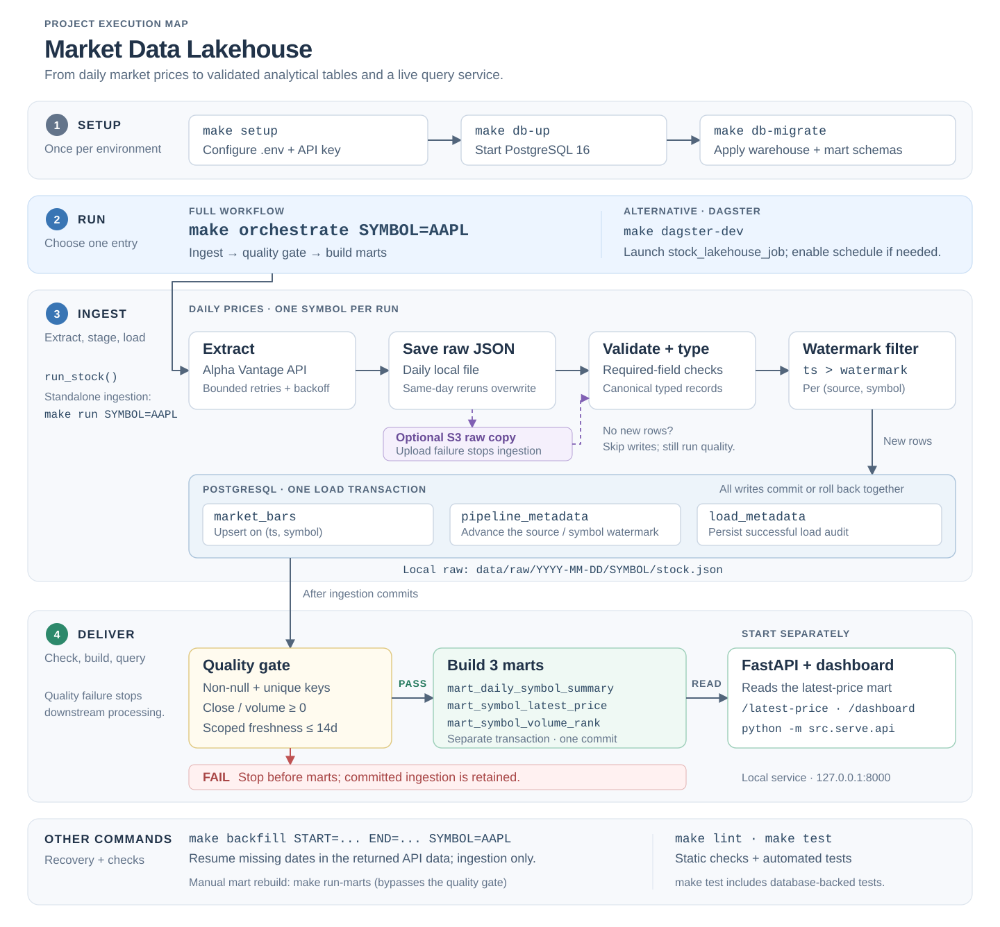

# de-lakehouse-pipeline

[](https://github.com/Ericliu-eng/de-lakehouse-pipeline/actions/workflows/ci.yml)

A market-data pipeline that loads daily prices from Alpha Vantage, backfills
decades of history from Tiingo, and serves an incremental PostgreSQL warehouse,
three analytical marts, and a FastAPI dashboard.

The project demonstrates API retry handling, schema validation, transactional
loading, watermarks, resumable backfills, quality gates, and local orchestration.
Optional S3 uploads preserve raw payloads in cloud storage.

**Validation snapshot — September 25, 2026 ([v1.1.0](CHANGELOG.md)):** a fresh
clone passed `make setup`, migrations, seeding, `make lint`, and `make test`
(157 tests) against PostgreSQL 16. The full suite (159 tests) measures 85% line
coverage.

## Architecture



```text
Alpha Vantage daily prices          Tiingo price history (one-off backfill)
  -> Raw JSON on local disk (+ optional S3 upload)
  -> Schema validation and typed staging
  -> Watermark filter
  -> PostgreSQL: market_bars + watermark + load audit
  -> Data quality gate
  -> Three analytical marts
  -> FastAPI / dashboard
```

Alpha Vantage is the daily incremental source. Tiingo backfills older dates
through the same raw landing, staging, and validation path, but inserts only
bars whose `(ts, symbol)` is not yet in the warehouse, so it never overwrites a
daily row and each bar keeps an accurate `source`.

The warehouse, watermark, and load-audit writes share one transaction. Quality
checks run after ingestion commits and before marts are rebuilt. A quality
failure stops downstream processing; it does not undo the completed ingestion.

**Stack:** Python · PostgreSQL 16 · SQL · Docker Compose · Dagster · FastAPI ·
AWS S3 · Terraform · pytest · Ruff · GitHub Actions.

## Engineering Highlights

| Capability | Implemented behavior |
| --- | --- |
| Extraction | Bounded retries with exponential backoff for HTTP 429/500/502/503/504, timeouts, connection errors, and provider throttle responses |
| Schema validation | Required fields are checked during production staging, before warehouse writes; values are converted to canonical types |
| Incremental loading | Watermark per `(source, symbol)`; only timestamps newer than the watermark enter the regular load |
| Idempotent writes | PostgreSQL upserts on the `(ts, symbol)` primary key prevent duplicate business keys |
| Atomic loading | Fact rows, watermark, and load audit commit or roll back together |
| Backfill recovery | Inclusive date ranges, one daily-series payload reused across pending dates, and checkpoints reconciled with database rows |
| Multi-source history | Tiingo backfill is insert-only on `(ts, symbol)`; its UTC-midnight dates are normalized to the warehouse's US/Eastern grain; overlapping days are reconciled against existing closes |
| Quality gates | Non-null keys, key uniqueness, non-negative close/volume, and freshness scoped to the active `(source, symbol)` |
| Orchestration | CLI runner with failure exit codes; Dagster job with explicit dependencies and a daily schedule definition |
| Serving | Database-backed price endpoint and HTML dashboard |

## Measured Results

From [the September 25, 2026 benchmark](docs/proof/2026-09-25-benchmark.md)
(`make benchmark`): saved Alpha Vantage payloads and Tiingo history for 10
symbols were replayed into a dedicated PostgreSQL 16 database on a local
Windows machine. No API calls were made.

**At scale — full price history**

| Metric | Result |
| --- | --- |
| Warehouse | 98,276 daily bars · 10 symbols · 1970-01-02 to 2026-09-25 |
| History backfill | 97,276 rows inserted in 7.2 s (about 13,500 rows/s); rerun inserts 0 |
| Cross-source reconciliation | 1,000 days covered by both sources: 0 closes differ by more than 0.5% (max 0.0%) |
| Quality checks over the full warehouse | 60/60 passed in 0.4 s |
| Mart rebuild over the full warehouse | 1.0 s |
| Daily 10-symbol orchestrated run | 15.3 s median; 91% is rebuilding the marts once per symbol |

**Correctness and recovery — 1,000-row Alpha Vantage replay**

| Metric | Result |
| --- | --- |
| Rerun of identical payloads | 0 new rows, 0 duplicate keys, watermarks unchanged |
| Incremental run | 50 of 1,000 staged rows loaded (5 new days × 10 symbols) |
| Rejected audit write | No partial writes across `market_bars`, `pipeline_metadata`, `load_metadata` |
| Backfill crash after 4 of 9 trading days | Resume loads the other 5; 0 gaps, 0 duplicates, 1 API fetch per run |
| Quality gate | 2 of 2 injected bad rows caught; marts not rebuilt |
| API retry | 429 → 503 → 200 succeeds on attempt 3; persistent 429 stops after 4 attempts (1 s, 2 s, 4 s backoff) |

**Live run and tests**

| Metric | Result |
| --- | --- |
| [Live Tiingo backfill](docs/proof/2026-09-25-tiingo-backfill.md) | 10 API requests, 20 s end to end; development warehouse grew from 1,225 to 98,282 rows; 1,219 overlapping days, 0 beyond 0.5% |
| Test suite | 159 tests; 85% line coverage (85–100% for ingestion, staging, loading, quality, backfill, CLI, and Dagster job modules) |

These are single-machine local measurements, not production SLAs. Retry
results use scripted HTTP responses rather than live throttling.

## Quickstart

**Prerequisites:** Python 3.10+, Git, GNU Make, and Docker with Compose (port
`5432` free). Tests use sample data and mocks; live ingestion also needs an
Alpha Vantage API key, and the history backfill needs a free Tiingo API token.

```bash
git clone https://github.com/Ericliu-eng/de-lakehouse-pipeline.git
cd de-lakehouse-pipeline
make setup
```

Create `.env` and activate the virtual environment:

```powershell
# PowerShell
Copy-Item .env.example .env
.\.venv\Scripts\Activate.ps1
```

```bash
# Bash / macOS / Linux
cp .env.example .env
source .venv/bin/activate
```

Start PostgreSQL and run the full validation:

```bash
make db-up
make db-migrate
make db-seed
make lint
make test
```

`make test` includes database-backed tests; use a disposable development
database. Without PostgreSQL, run `make unit` and `make smoke`. For live
ingestion, set `ALPHA_VANTAGE_API_KEY` in `.env`. See
[Development Setup](docs/DEV_SETUP.md) for database connection variables and
troubleshooting.

## Run the Pipeline and API

Run the complete workflow, including the quality gate:

```bash
make orchestrate SYMBOL=AAPL
```

A successful run prints `Status: success`, step results, and a JSON summary.
Failures return a non-zero exit code and stop later steps. Raw data lands at
`data/raw/YYYY-MM-DD/SYMBOL/stock.json`; database outputs include `market_bars`,
`pipeline_metadata`, `load_metadata`, and the three marts below.

Start the API from the repository root with the virtual environment active:

```bash
python -m src.serve.api
```

In another terminal, query the service:

```bash
curl http://127.0.0.1:8000/health
curl http://127.0.0.1:8000/latest-price
```

On Windows PowerShell, use `curl.exe` for these commands. The health response is
`{"status":"ok"}`; it confirms the API process is responding, not database
readiness. `/latest-price` returns one latest row across the available symbols;
it returns null price fields when the mart is empty.

- [Dashboard](http://127.0.0.1:8000/dashboard)
- [Interactive API documentation](http://127.0.0.1:8000/docs)
- [Saved serving screenshots](docs/proof/W17/2026-06-08-run.md)

### Analytical outputs

| Mart | Grain | Business question |
| --- | --- | --- |
| `mart_daily_symbol_summary` | One row per symbol and trading date | What are each symbol's daily close summary and total volume? |
| `mart_symbol_latest_price` | One row per symbol | What is the latest available close and volume? |
| `mart_symbol_volume_rank` | One row per symbol and trading date | Which symbols lead daily trading volume? |

Open `make db-shell` and inspect the results:

```sql
SELECT symbol, latest_ts, close_price, volume
FROM mart_symbol_latest_price
ORDER BY symbol;

SELECT source, symbol, last_watermark, last_row_count, status
FROM pipeline_metadata
ORDER BY source, symbol;
```

See [Demo Queries](docs/DEMO_QUERIES.md) for queries across all three marts, and
[their results](docs/proof/2026-09-25-mart-queries.md) on the full-history warehouse.

## Backfill and Dagster

| Command | Purpose |
| --- | --- |
| `make run SYMBOL=MSFT` | Ingest one symbol; does not run the publication quality gate or rebuild marts |
| `make run-marts` | Rebuild marts directly from warehouse data; bypasses the quality gate |
| `make backfill START=2026-09-14 END=2026-09-18 SYMBOL=AAPL` | Load missing dates in an inclusive range |
| `make tiingo-backfill SYMBOL=AAPL,MSFT` | Load full Tiingo history for each symbol without overwriting existing rows |
| `make dagster-dev` | Start the local Dagster development UI and daemon |
| `make db-shell` | Open psql in the Docker database |
| `make db-down` | Stop the Compose stack while retaining its database volume |

For backfills, replace the example range with dates present in the provider's
returned daily payload. The command cannot retrieve dates absent from that
payload. It skips dates already present in the database and does not provide a
force-reprocess option for historical corrections. Repeating the command resumes
missing dates; weekends and other dates without bars are not marked complete.

`make tiingo-backfill` needs `TIINGO_API_TOKEN` in `.env` and makes one request
per symbol. Rerunning it inserts nothing new. Run `make run-marts` afterwards to
rebuild the marts over the added history. See [Backfill](docs/BACKFILL.md).

In the Dagster UI, launch `stock_lakehouse_job`. Its default symbol is `AAPL`;
to change it, use this launch configuration:

```yaml
ops:
  ingest_stock:
    config:
      symbol: MSFT
```

The job runs ingestion -> quality checks -> marts. The schedule definition is
`0 8 * * *`; enable it in the local UI and keep Dagster running to execute it.
See the [saved successful Dagster run](docs/proof/W17/screenshots/06-14/image1.png).

## Optional S3 Raw Storage

Both regular ingestion and date-based backfill call the S3 upload adapter. When
enabled, the adapter creates a boto3 client using the standard AWS credential
chain, or uses an explicitly supplied client.

Configure the following in the ingestion environment or local `.env`:

```dotenv
ENABLE_S3_RAW_UPLOAD=true
S3_RAW_BUCKET=your-existing-bucket-name
```

Use a configured AWS profile or role with `s3:PutObject` access to the bucket's
`raw/*` prefix. The destination bucket must already exist. Uploaded keys follow:

```text
raw/alpha_vantage/symbol=AAPL/date=YYYY-MM-DD/stock.json
```

When upload is enabled, a configuration or upload error fails the ingestion
before warehouse writes. The local raw file has already been saved at that point.

The [Terraform module](infra/terraform/main.tf) defines the bucket, public-access
blocking, ownership controls, encryption, versioning, and a raw-write IAM policy.
Attaching the policy to the identity used by the pipeline remains a deployment
step. `make terraform-validate` checks configuration and does not provision AWS
resources; it requires Terraform 1.5+ and network access for provider installation.

## Validation and Evidence

| Command | Purpose |
| --- | --- |
| `make lint` | Ruff static analysis |
| `make unit` | Unit tests without PostgreSQL |
| `make smoke` | Smoke tests without PostgreSQL |
| `make smoke-db` | Database-backed smoke tests |
| `make integration` | Marts, metadata, and transactional rollback tests |
| `make test` | Default unit, smoke, and integration validation |
| `make test-all` | Collect and run every test under `tests/` |
| `make coverage` | Run every test with a line coverage report for `src/` and `orchestration/` |
| `make terraform-validate` | Terraform formatting, initialization, and validation |
| `make benchmark` | Replay saved payloads in a throwaway database and write a results report |

CI runs on pull requests and pushes to `main`. It provisions PostgreSQL 16,
installs dependencies, migrates and seeds the database, runs Ruff and
`make test`, and validates Terraform.

The September 20 local validation used
`python -m pytest tests -q -p no:cacheprovider`
against a temporary database with no project data volume.
Coverage includes retry exhaustion, malformed source records, incremental
reruns, checkpoint recovery, quality-gate failures, and real PostgreSQL rollback
after a rejected audit write. It does not constitute a fresh-clone installation
test or a live AWS/API benchmark.

On September 25, `make coverage` against a freshly migrated and seeded database
ran 159 tests and measured **85% line coverage** (946 of 1,112 statements).
Core modules are covered at 85–100%: pipeline 93%, staging 100%, quality checks
96%, API client 92%, backfill 85%, Tiingo backfill 98%, CLI 95%, and the Dagster
job and schedule 100%.
The remaining gaps are the CSV export and the `checkdb` inspection helper (0%),
the serving API (71%), and the standalone entry points of the mart modules.

Historical evidence is available under [docs/proof](docs/proof), including
[transaction and retry hardening](docs/proof/2026-09-07-reliability-hardening.md)
and [Terraform bucket/IAM apply and destroy](docs/proof/W16/2026-06-06-run.txt).
Evidence files describe the version and environment used at the time.

## Project Status

The core pipeline is complete and tested end to end on PostgreSQL. The remaining
work is evidence, operational metrics, and release packaging rather than new
pipeline features.

| Area | Status | Notes |
| --- | --- | --- |
| Extraction, raw landing, retries | Done | Retry/throttle paths covered by unit tests |
| Staging, schema validation, data contract | Done | Validator runs on the production staging path |
| Warehouse model and migrations 001–008 | Done | Fresh-database migration verified |
| Historical data | Done | Tiingo backfill: 97,057 bars for 10 symbols, reconciled with Alpha Vantage |
| Incremental watermark and idempotent upserts | Done | Rerun produces an empty batch and unchanged watermark |
| Transactional loading and failure drills | Done | Real PostgreSQL rollback test after a rejected audit write |
| Quality gate | Done | Not-null, unique, range, per-`(source, symbol)` freshness; FK not applicable (no parent dimension) |
| Marts and serving API | Done | Three marts, `/health`, `/latest-price`, `/dashboard` |
| Dagster orchestration | Done | Job + daily schedule; saved UI run evidence |
| CI | Done | Lint, unit, smoke, integration, Terraform validate |
| Terraform S3 bucket and IAM | Done | Historical apply/destroy evidence |
| Backfill | Partial | Resumable ranges; no force-reprocess for historical corrections |
| Operational metrics | Partial | JSON step metrics only; no persisted run history or failure-rate query |
| Live S3 evidence | Partial | Fake-client tests pass; live-upload note lacks recorded results |
| Release | Done | v1.1.0 verified from a fresh clone; see [CHANGELOG](CHANGELOG.md) |
| Demo video | Not started | — |

### Known limits

- **Unadjusted prices:** both sources load unadjusted OHLCV so the series join
  cleanly, which means stock splits appear as price jumps (for example AAPL on
  2020-08-31). Split-adjusted analysis would need an adjusted-price column.
- **Historical data:** regular loading accepts only timestamps newer than the
  watermark, and backfill skips existing dates. Same-day local raw files are
  overwritten on rerun rather than kept as immutable per-run snapshots.
- **Metrics:** the CLI runner emits step status, timing, and JSON metrics, but
  some step row counts are unavailable and SLA helpers are not wired into live
  runs.
- **Deployment:** Dagster and FastAPI run as local development services. The
  API has no authentication; hosting and alerting are not configured.

### Next steps

1. Rebuild marts once per batch (or incrementally) instead of once per symbol;
   at 98k rows that rebuild is 91% of a daily 10-symbol run.
2. Persist a `pipeline_runs` record (status, duration, loaded rows) and add a
   failure-rate SQL query.
3. Add a force-reprocess option for historical date ranges.
4. Record a live S3 upload with the resulting object key and read-back.
5. Record a 2–4 minute demo: ingest -> quality gate -> marts -> serving.

The full list of open items and resume-ready criteria is in
[Project Status](docs/PROJECT_STATUS.md).

## Repository Guide

| Location | Contents |
| --- | --- |
| `src/de_lakehouse_pipeline/` | Ingestion, staging, loading, quality, backfill, and metrics |
| `src/serve/` | FastAPI endpoints and dashboard template |
| `orchestration/` | CLI runner and Dagster definitions |
| `migrations/` | Numbered database schema changes |
| `sql/marts/` | Analytical transformations |
| `infra/terraform/` | S3 infrastructure definitions |
| `tests/` | Unit, smoke, and database integration tests |
| `docs/proof/` | Dated logs, validation notes, and screenshots |

## Documentation

| Topic | Document |
| --- | --- |
| Architecture | [docs/ARCHITECTURE.md](docs/ARCHITECTURE.md) |
| Setup and operations | [docs/DEV_SETUP.md](docs/DEV_SETUP.md), [docs/RUNBOOK.md](docs/RUNBOOK.md) |
| Data model and queries | [docs/DATA_MODEL.md](docs/DATA_MODEL.md), [docs/DATA_CONTRACT.md](docs/DATA_CONTRACT.md), [docs/DEMO_QUERIES.md](docs/DEMO_QUERIES.md) |
| Schema changes | [docs/SCHEMA_EVOLUTION.md](docs/SCHEMA_EVOLUTION.md) |
| Incremental loading and backfill | [docs/INCREMENTAL.md](docs/INCREMENTAL.md), [docs/BACKFILL.md](docs/BACKFILL.md) |
| Data quality | [docs/DATA_QUALITY.md](docs/DATA_QUALITY.md) |
| Orchestration and metrics | [docs/ORCHESTRATION.md](docs/ORCHESTRATION.md), [docs/OPS_METRICS.md](docs/OPS_METRICS.md) |
| Reliability | [docs/FAILURE_DRILLS.md](docs/FAILURE_DRILLS.md) |
| Cloud storage | [docs/CLOUD_STORAGE.md](docs/CLOUD_STORAGE.md), [infra/terraform/README.md](infra/terraform/README.md) |
| Status and roadmap | [docs/PROJECT_STATUS.md](docs/PROJECT_STATUS.md) |
| Contribution standards | [docs/STANDARDS.md](docs/STANDARDS.md) |
