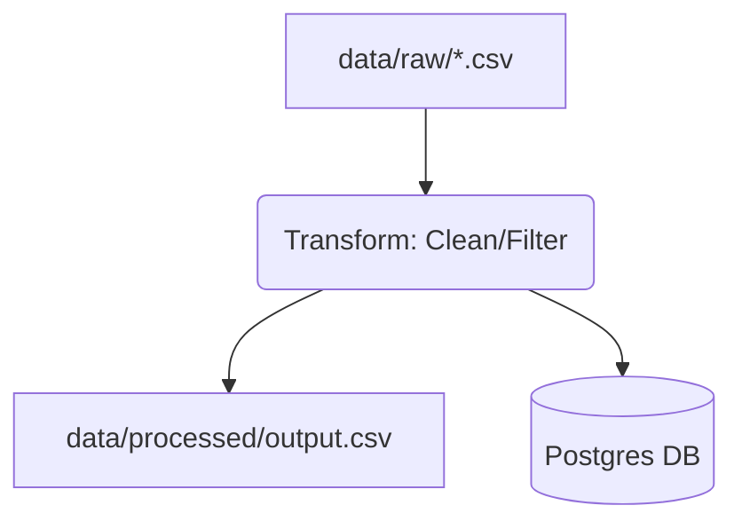

# de-lakehouse-pipeline

A lakehouse-style data engineering pipeline with reproducible workflows, testing, and CI integration.

---

## Overview
This project implements a minimal but production-style data pipeline:
Raw Data → Transform → Storage (File + Postgres)
It is designed to demonstrate:
- Reproducible data engineering workflows
- Modular pipeline design
- Database integration (Postgres)
- CI-tested data pipelines
---

##  Architecture

---

## Components
- **Extract**: Read raw CSV data
- **Transform**:
  - Drop null values
  - Filter invalid rows (e.g., negative values)
- **Load**:
  - Save processed CSV
  - Insert into Postgres tables
---

## Quickstart
```bash
cp .env.example .env
make setup
make db-up
make migrate
make run
make test
```
---

## Database (Postgres)
Start DB:
```bash
make db-up
```
Run migrations:
```bash
make migrate
```
Smoke test
```bash
make smoke
```
---

## Testing
This project includes multiple layers of testing:
#### Unit Tests
  - Transform logic validation
  - Edge cases (nulls, invalid values)
#### Smoke Tests
  - End-to-end pipeline execution (tmp_path)
  - Database connectivity (test_db_smoke.py)
#### Run all tests:
```bash
make test
```
---

## Example
| Stage | Data Sample |
| :--- | :--- |
| **Input** (`data/raw/sample.csv`) | `name,amount`<br>`A,10`<br>`B,-5`<br>`,20` |
| **Output** (`data/processed/output.csv`) | `name,amount`<br>`A,10` |

---

## Database Schema
#### Example table (via migration):
- users
  - id (int)
  - name (text)
  - amount (int)
#### Created using:
```bash
make migrate
```
---

## Project Structure
```markdown 
src/de_lakehouse_pipeline/   # pipeline logic
scripts/                     # migration scripts
tests/                       # unit + smoke tests
data/                        # raw + processed data
docs/                        # proof / logs
```

---

## Reproducibility
##### All workflows are standardized via Makefile:
```bash
make setup
make lint
make test
make run
make migrate
```
#### Works consistently across:
 - Local environment
 - CI (GitHub Actions)
---

## CI
#### GitHub Actions automatically runs:
```bash
make lint
make test
```
#### on every pull request.
----

## Why this project
#### This project demonstrates:
  - Data Engineering best practices (modularity, testing, CI)
  - Reproducible pipelines using Makefile
  - Database-backed workflows with migration
  - Foundations for scaling into MLOps / production systems
