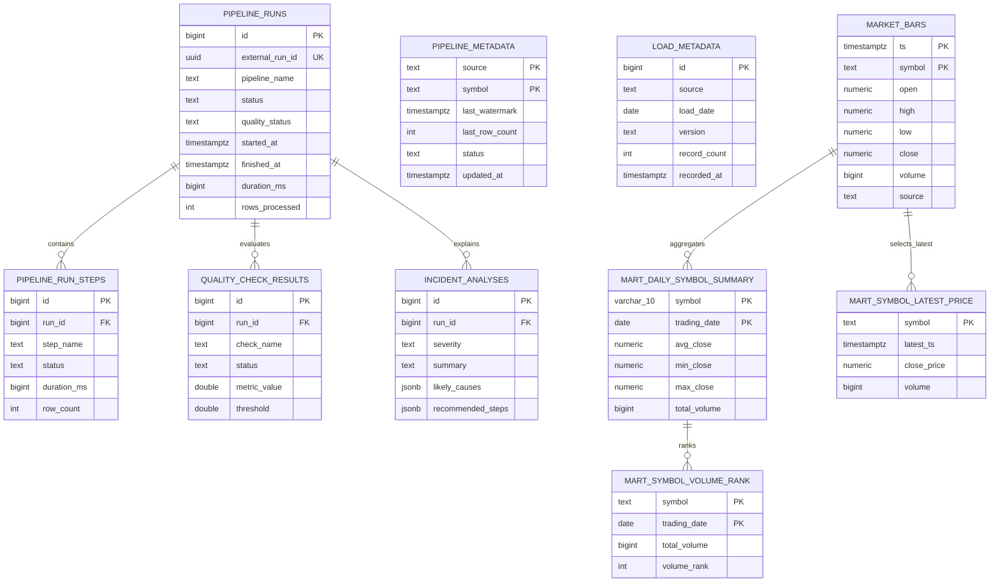

# Data Model

## Lineage

```text
market_bars
  |-> mart_daily_symbol_summary
  |     `-> mart_symbol_volume_rank
  `-> mart_symbol_latest_price

pipeline_metadata  -> incremental state
load_metadata      -> load audit history

pipeline_runs
  |-> pipeline_run_steps
  |-> quality_check_results
  `-> incident_analyses
```

## Entity Relationship Diagram



Warehouse-to-mart arrows describe transformation lineage, not enforced foreign
keys. The three observability child tables do have foreign keys to
`pipeline_runs`, with cascading deletion. Load and watermark metadata are
associated with warehouse rows through source/symbol context.

All marts are physical PostgreSQL tables refreshed with upsert semantics.

## Model Catalog

| Object | Purpose | Grain | Primary key |
| --- | --- | --- | --- |
| `market_bars` | Normalized Alpha Vantage and Tiingo market bars | One row per timestamp and symbol | `(ts, symbol)` |
| `pipeline_metadata` | Incremental state by source and symbol | One row per source and symbol | `(source, symbol)` |
| `load_metadata` | Load-level audit history | One row per load event | `id` |
| `pipeline_runs` | Durable pipeline execution history | One row per pipeline run | `id` |
| `pipeline_run_steps` | Step-level execution telemetry | One row per step execution | `id` |
| `quality_check_results` | Quality outcomes linked to a run | One row per check result | `id` |
| `incident_analyses` | Stored incident summaries and recommendations | One row per analysis | `id` |
| `mart_daily_symbol_summary` | Daily close-price statistics and volume | One row per symbol and trading date | `(symbol, trading_date)` |
| `mart_symbol_latest_price` | Latest price snapshot | One row per symbol | `symbol` |
| `mart_symbol_volume_rank` | Daily symbol ranking by total volume | One row per symbol and trading date | `(symbol, trading_date)` |

## Warehouse Tables

### `market_bars`

- `ts`: timezone-aware market timestamp
- `symbol`: normalized ticker symbol
- `open`, `high`, `low`, `close`: market prices
- `volume`: traded volume
- `source`: upstream source, defaulting to `alpha_vantage`

Supported publication commands require non-null keys, unique `(ts, symbol)`,
finite non-negative OHLC prices with consistent ranges, present non-negative
volume, and no future trading dates. Daily orchestration also requires a recent
bar for the active source/symbol. See the [data contract](DATA_CONTRACT.md) for
staging validation, including integral volume.

### `pipeline_metadata`

- `source`, `symbol`: incremental-state key
- `last_watermark`: latest processed market timestamp
- `last_row_count`: rows processed in the latest successful load
- `status`: latest persisted load status
- `updated_at`: state update timestamp

### `load_metadata`

- `id`: load event identifier
- `source`: upstream source
- `load_date`: load date
- `version`: source or run version
- `record_count`: processed record count
- `recorded_at`: audit insert timestamp

### Observability tables

- `pipeline_runs` stores the durable run identity, terminal status, timing,
  processed-row count, and top-level error details.
- `pipeline_run_steps`, `quality_check_results`, and `incident_analyses` have
  schemas for step telemetry, check results, and incident recommendations.
  The runner currently persists only top-level `pipeline_runs`; those child
  tables are not populated by orchestration. Their foreign keys cascade when
  the parent run is removed.

## Analytical Marts

| Mart | Columns | Business use |
| --- | --- | --- |
| `mart_daily_symbol_summary` | `symbol`, `trading_date`, `avg_close`, `min_close`, `max_close`, `total_volume`, `created_at` | Daily close and volume; with one bar per day the three close statistics are equal |
| `mart_symbol_latest_price` | `symbol`, `latest_ts`, `close_price`, `volume`, `updated_at` | Serve the latest symbol snapshot |
| `mart_symbol_volume_rank` | `symbol`, `trading_date`, `total_volume`, `volume_rank` | Find daily volume leaders |

`mart_symbol_volume_rank` uses `DENSE_RANK()` within each trading date.
`created_at` on the daily summary records initial row creation and is not
updated during an upsert.
Mart upserts do not remove rows when source rows are deleted. Source correction
or deletion therefore requires explicit mart cleanup and a subsequent build;
automatic deletion synchronization is not implemented.

See `docs/DATA_QUALITY.md` for quality gates and `docs/DEMO_QUERIES.md` for
example analytical queries.
