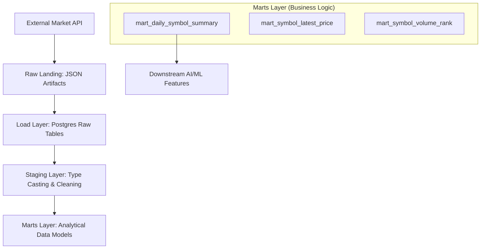

# de-lakehouse-pipeline (README v2)

A minimal **production-style data engineering pipeline** demonstrating:

* API ingestion
* raw data landing
* database load with idempotent upsert
* reproducible workflows
* SQL validation
* CI-tested pipeline execution

This project serves as a foundation for progressing from
**Data Engineering → MLOps → ML Systems → AI Platform.**

---

## Overview

This pipeline implements a realistic ingestion architecture:

```
External API → Raw Landing (JSON) → Load Layer → Postgres Raw Tables → Transform / Analytics
```

Key engineering goals:

* Reproducibility
* Modularity
* Safe reruns (idempotent load)
* Database-backed workflows
* Testable data pipelines

---

## Architecture



---

## Demo (2-minute local run)

```bash
git clone https://github.com/Ericliu-eng/de-lakehouse-pipeline.git
cd de-lakehouse-pipeline

cp .env.example .env

make setup
make db-up
make migrate
make run-stock
make db-shell
```

Then verify:

```sql
SELECT COUNT(*) FROM market_bars;
SELECT * FROM market_bars ORDER BY ts DESC LIMIT 5;
```

---

## Pipeline Stages

### Ingest

* Fetch market data from Alpha Vantage API
* Persist raw responses as dated JSON artifacts

Example:

```
data/raw/2026-03-16/stock.json
```

---

### Load

* Parse nested time-series payload
* Normalize timestamps and numeric values
* Upsert rows into Postgres

Key feature:

**Pipeline can be safely rerun without duplicating data.**

---

### Transform

* Future stage for staging tables
* Schema normalization
* Data quality enforcement
* Feature preparation for analytics / ML

---

## Database Schema

Example raw table:

```
market_bars
-----------
ts timestamptz
symbol text
open numeric
high numeric
low numeric
close numeric
volume bigint
PRIMARY KEY (ts, symbol)
```

This design supports:

* Time-series storage
* deduplication via composite key
* incremental ingestion

---

## Reproducible Workflows (Makefile)

Common commands:

```bash
make setup        # create venv + install deps
make run-stock    # run stock ingestion pipeline
make migrate      # apply DB schema
make db-up        # start Postgres container
make test         # run all tests
make smoke        # end-to-end smoke tests
```

---

## Testing Strategy

### Unit Tests

* SQL utility validation
* DB config behavior
* extraction helpers
* transformation parsing logic

### Smoke Tests

* end-to-end pipeline execution
* database connectivity
* load verification

---

## SQL Validation Layer

Reusable SQL patterns included:

* Window functions for deduplication
* Data quality checks
* Tested SQL execution via pytest

Location:

```
sql/
```

---

## CI (GitHub Actions)

On every pull request:

* environment setup
* lint checks
* DB migration
* smoke tests
* full pytest suite

Ensures pipeline reproducibility across environments.

---

## Why this Project

Demonstrates real engineering concepts:

* ingestion architecture design
* database load semantics
* idempotent pipeline execution
* test-driven data workflows
* CI integration

Serves as a stepping stone toward:

* MLOps systems
* feature pipelines
* AI platform infrastructure

---
