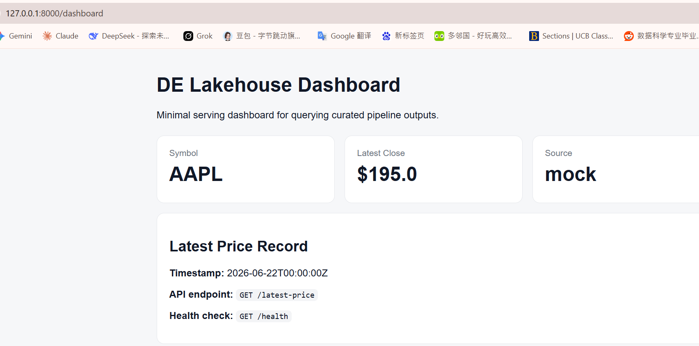

# Proof — W017D01

**Date:** 2026-06-08
**Repo:** `de-lakehouse-pipeline`
**Scope:** Dashboard / Serving — Minimal Visualization and Query API

---

## Goal

This proof verifies that the serving layer can:

1. Start the local Postgres database.
2. Launch the FastAPI service.
3. Expose a health check endpoint.
4. Return the latest stock price from the query API.
5. Render a minimal dashboard page.

---

## Environment

| Item              | Value                   |
| ----------------- | ----------------------- |
| Project           | `de-lakehouse-pipeline` |
| Serving framework | FastAPI / Uvicorn       |
| Database          | Postgres                |
| Local server      | `http://127.0.0.1:8000` |

---

## Step 1 — Start Postgres

### Command

```bash
make db-up
```

### Output

```text
docker compose up -d
[+] up 1/1
✔ Container de_lakehouse_db Running
```

### Result

Postgres container started successfully.

---

## Step 2 — Start FastAPI Server

### Command

```bash
python -m serve.api
```

### Output

```text
INFO:     Will watch for changes in these directories: ['C:\\Users\\liuxu\\de-lakehouse-pipeline']
INFO:     Uvicorn running on http://127.0.0.1:8000
INFO:     Started reloader process [9268] using StatReload
INFO:     Started server process [9972]
INFO:     Waiting for application startup.
INFO:     Application startup complete.
```

### Result

The FastAPI server started successfully.

---

## Step 3 — Health Check Endpoint

### URL

```text
http://127.0.0.1:8000/health
```

### Screenshot


### Result

The `/health` endpoint responds successfully.

---

## Step 4 — Latest Price API

### URL

```text
http://127.0.0.1:8000/latest-price
```

### Screenshot


### Result

The `/latest-price` endpoint returns stock price data successfully.

---

## Step 5 — Dashboard Page

### URL

```text
http://127.0.0.1:8000/dashboard
```

### Screenshot



### Result

The dashboard page renders successfully.

---

## Summary

The serving layer works locally.

FastAPI starts successfully, connects to the local Postgres-backed project environment, exposes the `/health` endpoint, returns latest stock price data through `/latest-price`, and renders a minimal visualization dashboard through `/dashboard`.

This confirms the minimal serving and dashboard layer for W017D01.
