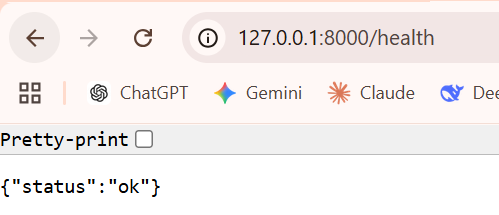
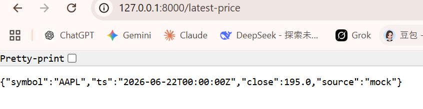

# Proof — W016D04
# Date: 2026-06-07
# Repo: de-lakehouse-pipeline
# Scope: Dashboard / Serving: Minimal Visualization and Query API
==================================================
step 1:
Command:
    make db-up
Output:
    docker compose up -d
    [+] up 1/1
    ✔ Container de_lakehouse_db Running  
==================================================

step 2:
Command:
    python -m serve.api
Output:
    INFO:     Will watch for changes in these directories: ['C:\\Users\\liuxu\\de-lakehouse-pipeline']
    INFO:     Uvicorn running on http://127.0.0.1:8000 (Press CTRL+C to quit)
    INFO:     Started reloader process [9268] using StatReload
    INFO:     Started server process [9972]
    INFO:     Waiting for application startup.
    INFO:     Application startup complete.

==================================================

step 3:
Command:
    http://127.0.0.1:8000/health
Output:
    

==================================================
step 4:
Command:
    http://127.0.0.1:8000/latest-price
Output:
    

==================================================
step 5:
Command:
    http://127.0.0.1:8000/dashboard
Output:
    

