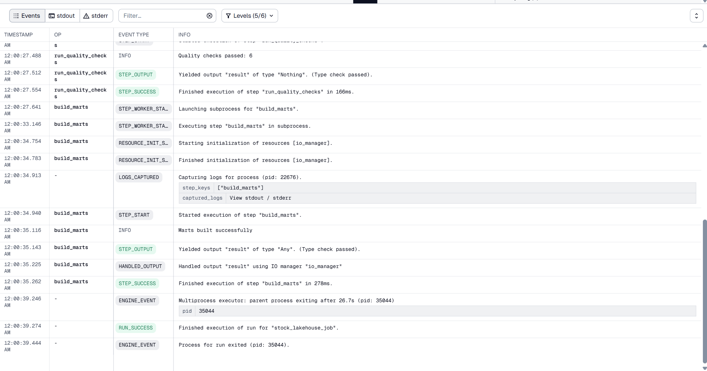

# Proof — W017D04
# Date: 2026-06-13
# Repo: de-lakehouse-pipeline
==================================================
step 1:
Command:
    make db-down
    make db-up
Output:
    [+] down 2/2
    ✔ Container de_lakehouse_db             Removed                                                                                                                                0.4s
    ✔ Network de-lakehouse-pipeline_default Removed                                                                                                                                0.3s
    docker compose up -d
    [+] up 2/2
    ✔ Network de-lakehouse-pipeline_default Created                                                                                                                                0.0s
    ✔ Container de_lakehouse_db             Created 
==================================================
step 2:
Command:
    dagster-dev:
        $(PY) -m dagster dev -m orchestration.definitions
Output:
    

==================================================
setp 3:
Command:
    run
Output:
    